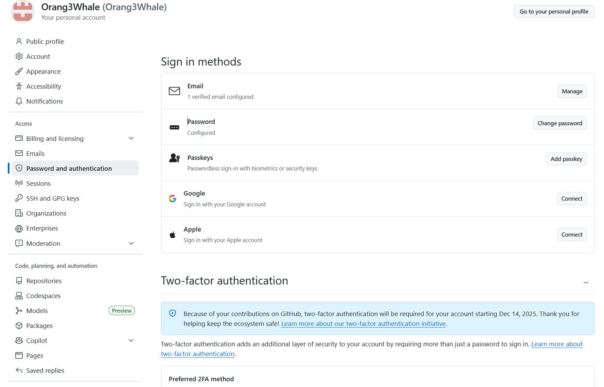
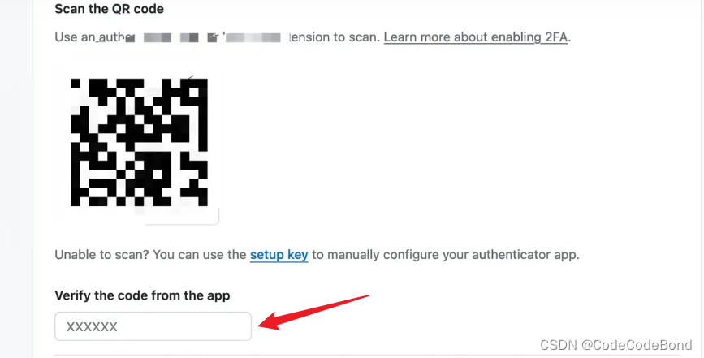

# 2FA认证教程

​	本教程介绍如何进行GitHub中的2FA认证（two-factor authentication）。

## ❓什么是2FA认证

​在你开始向GitHub上贡献代码时，GitHub官方会向你发布一个“2FA认证通知”，期限为45天，用户需要在期限内完成2FA认证，否则将会冻结账户。该举措旨在提升账户的安全性，具体说明细则详见GitHub文档：[配置双重身份认证](https://docs.github.com/zh/authentication/securing-your-account-with-two-factor-authentication-2fa/configuring-two-factor-authentication)。

## 🔧启用2FA认证
```
1. 登录GitHub账号，点击头像，选择“Settings”。
2. 在“Settings”页面，寻找“Access”目录。
3. 在“Access”目录下，点击“Password and authentication”。
4. 按照页面提示，扫描二维码或输入验证码，启用2FA认证。
5. 完成2FA认证后，你可以在“Access”页面，查看已启用的2FA认证方式。
```

___

___
## 💡认证工具下载

​由于谷歌商店在国内不可用,因此我们可以采用微软的*Authenticator*软件进行2FA认证,前往手机应用商店，搜索*Authenticator*软件，下载安装。

___
## 📱使用Authenticator进行2FA认证
```
1. 打开Authenticator软件，点击“添加账户”。
2. 在“添加账户”页面，点击“扫描二维码”。
3. 扫描GitHub账号中的2FA认证二维码。
4. 输入2FA认证码，完成添加。
5. 完成扫描后，你可以在Authenticator软件中，查看已添加的账户。
```


