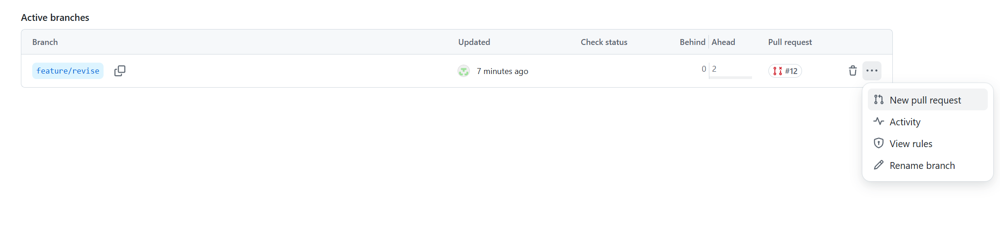
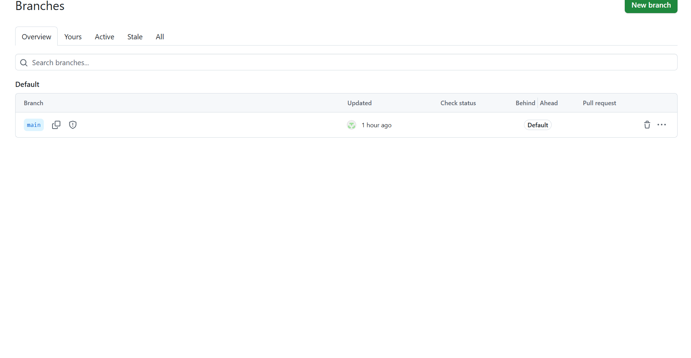

# 一、07Vscode使用git教程

## 在 VS Code 中与 GitHub 远程仓库互联

### 1. 首先登录


```
# 配置全局用户信息
git config --global user.name "你的用户名"
git config --global user.email "你的邮箱"
```

## 连接 GitHub 的步骤

### 方法一：使用 VS Code 内置的 Git 功能

**方式 A：通过 HTTPS（推荐新手）**

1. 在 VS Code 中打开项目文件夹
2. 按 `Ctrl+Shift+P`打开命令面板
3. 输入 `Git: Clone`并选择
4. 输入 GitHub 仓库的 HTTPS URL
5. 选择本地保存位置

**方式 B：通过 SSH（更安全）**

1. 生成 SSH 密钥：

```
ssh-keygen -t ed25519 -C "your_email@example.com"
```

1. 将公钥添加到 GitHub：`cat ~/.ssh/id_ed25519.pub`
2. 在 GitHub Settings → SSH and GPG keys 中添加

### 方法二：使用 GitHub Copilot 扩展

1. 安装 "GitHub Pull Requests and Issues" 扩展
2. 按 `Ctrl+Shift+P`搜索 "GitHub: Sign In"
3. 按照提示完成认证

### 方法三：手动连接现有项目

```
# 在项目根目录执行
git init
git remote add origin https://github.com/用户名/仓库名.git
git branch -M main
git push -u origin main
```

### 常用操作指南

### 提交更改

1. 在 VS Code 左侧点击源代码管理图标（第三个）
2. 在更改的文件旁点击 `+`号暂存
3. 输入提交信息
4. 点击 √ 提交
5. 点击 `...`→ 推送到远程仓库

### 拉取更新

- 点击左下角的同步按钮
- 或使用 `Git: Pull`命令

## 02.具体上传流程

###  01建立并切换分支

```
# 1. 确保在最新的 main 上
git checkout main
git pull origin main

# 2. 创建新分支
git checkout -b feature/新功能
```


### 02 在消息框内填入你本次修改了什么内容然后再点击提交


**此处内容可不填然后点击发布**


### 03提交 PR 的建议

#### 建立PR




#### 写入变更描述


```
## 📝 变更描述
简要描述这个 PR 做了什么

## 🎯 变更类型
- [x] 新功能（feature）
- [ ] Bug 修复（bugfix）
- [ ] 文档更新（docs）
- [ ] 代码重构（refactor）
- [ ] 性能优化（performance）

## 💡 实现方案
详细说明：
- 做了什么修改
- 为什么要做这些修改
- 如何实现的

## ✅ 测试
- [x] 本地测试通过
- [x] 添加了单元测试
- [x] 更新了文档

## 📷 截图（如果适用）
（添加截图或 GIF）

## 🔗 相关 Issue
Closes #123
```


### 04删除本地分支(确保提交完成之后)


#### 01切换分支(如果要继续修改则不要切换分支)


#### 02删除本地分支


```
# 1. 切换回 main 分支
git checkout main

# 2. 拉取最新代码（包含刚刚合并的内容）
git pull origin main

# 3. 删除本地分支
git branch -d feature/已完成的功能
```


### 05合并分支


### 06删除远程分支

##### 01通过代码删除

```
#1. 删除远程分支（如果还没删除）
git push origin --delete feature/已完成的功能

# 2. 开始新功能，创建新分支
git checkout -b feature/新功能
```


##### 02在github里直接删除远程分支



### 06更新本地仓库

```
git checkout main
git pull origin main
```


## 常见问题：vscode连接远程仓库失败解决方法

##  01

```
arp -a  #查看当前网络下所有的IP
git init #在当前文件夹初始化git
#设置VPN后git还是同步失败，则输入以下命令
git config --global http.proxy http://127.0.0.1:7890
git config --global https.proxy http://127.0.0.1:7890
```


### 02 

#### 打开命令窗口


#### 找到host文件并更改


####        点击保存即可
