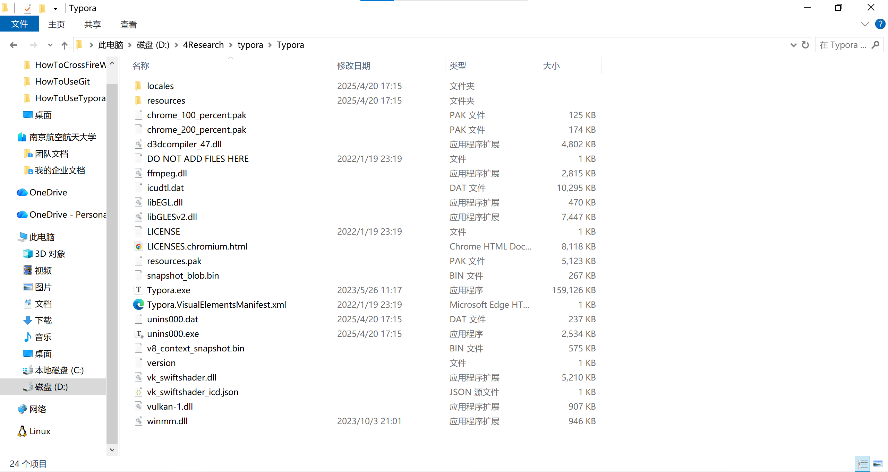

# 01 - Typora 安装与设置

本教程将指导你安装 Typora 并进行基础配置。

## 📋 目录

- [什么是 Markdown](#什么是-markdown)
- [什么是 Typora](#什么是-typora)
- [安装 Typora](#安装-typora)
- [Typora 基础设置](#typora-基础设置)

---

## 什么是 Markdown

Markdown 是一种轻量级标记语言，具有以下特点：

- ✍️ **简单易学**：使用纯文本格式，语法简洁
- 📝 **专注内容**：无需关心排版细节
- 🔄 **可转换**：可导出为 HTML、PDF、Word 等格式
- 🌐 **广泛应用**：GitHub、博客、文档等都支持

Markdown 文件通常以 `.md` 或 `.markdown` 为扩展名。

---

## 什么是 Typora

Typora 是一款优秀的 Markdown 编辑器，特点包括：

- 👁️ **所见即所得**：实时预览，边写边看效果
- 🎨 **界面简洁**：专注写作，无干扰界面
- 📊 **支持图表**：内置数学公式、图表支持
- 🖼️ **图片管理**：方便的图片插入和管理
- 🎯 **多种主题**：可自定义编辑器外观

---

## 安装 Typora

### Windows 系统

1. **访问官网下载**
   - 官网：https://typora.io/
   - 点击 "Download" 按钮
   - 选择 Windows 版本下载

2. **安装步骤**
   - 双击下载的安装包
   - 选择安装路径
   - 点击"安装"完成

3. **激活（可选）**
   - Typora 需要购买许可证
   - 15 天免费试用期
   - 支持买断制（约 $14.99）

**或获取破解版：**

向 @Tiger 要破解版压缩包 Typora v1.9.5.rar，解压后点击 Setup.exe，推荐安装至**非**系统盘。

安装完成后，打开安装路径，将解压后的另一个文件夹 Crack 中的 winmm.dll 移动到这里（图片所示的文件夹，路径不一定一样，但内容多半差不多！）



---

### macOS 系统

**方法一：官网下载**
- 访问 https://typora.io/ 下载 macOS 版本
- 将下载的 `.app` 拖入 Applications 文件夹

**方法二：使用 Homebrew**
```bash
brew install --cask typora
```

---

### Linux 系统

**Ubuntu/Debian：**
```bash
wget -qO - https://typora.io/linux/public-key.asc | sudo apt-key add -
sudo add-apt-repository 'deb https://typora.io/linux ./'
sudo apt-get update
sudo apt-get install typora
```

---

### 免费替代品

如果不想购买 Typora，可以考虑以下免费替代：
- **Obsidian**（免费，功能强大）
- **Mark Text**（开源免费）
- **VS Code + Markdown Preview Enhanced 插件**
- **MarkdownPad**（Windows）

---

## Typora 基础设置

### 推荐设置

打开 Typora，进入 `文件` -> `偏好设置`：

#### 1. 通用设置
- ✅ 启动时：创建新文件
- ✅ 自动保存
- ✅ 自动配对括号和引号

#### 2. 外观设置
- 选择你喜欢的主题（推荐：GitHub 主题）
- 设置字体和字号

#### 3. 图像设置（重要！）
- 插入图片时：选择 "复制到指定路径"
- 路径设置：`./assets/${filename}` 或 `./images`
- ✅ 优先使用相对路径
- ✅ 对本地位置的图片应用上述规则

#### 4. Markdown 设置
- ✅ 智能标点
- ✅ 自动转义（如将 `--` 转为 `—`）
- 标题级别：1-6
- ✅ 显示行号（代码块）

#### 5. 编辑器设置
- ✅ 默认缩进：2 个空格或 4 个空格
- ✅ 智能标点
- ✅ 拼写检查

---

## 下一步

安装和配置完成后，继续学习：

👉 **[02 - Markdown 基础语法](./02-Markdown基础语法.md)** - 学习 Markdown 的核心语法

---

**相关教程：**
- 👈 [返回总览](./README.md)
- 👉 [02 - Markdown 基础语法](./02-Markdown基础语法.md)

