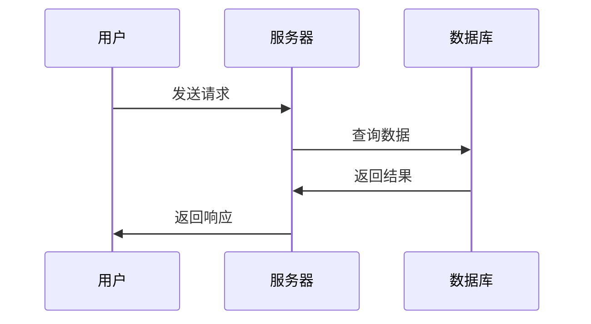

# 03 - Markdown 高级功能

本教程介绍 Markdown 和 Typora 的高级功能。

## 📋 目录

- [插入链接](#插入链接)
- [插入图片](#插入图片)
- [数学公式](#数学公式)
- [图表](#图表)
- [其他高级功能](#其他高级功能)

---

## 插入链接

### 基础链接
```markdown
[链接文本](https://www.example.com)
[百度](https://www.baidu.com)
```

### 内部跳转（锚点）
```markdown
[跳转到某章节](#章节标题)
```

**快捷键：** `Ctrl + K` 插入链接

---

## 插入图片

### 基础语法
```markdown


```

### 在 Typora 中插入图片

**方法一：拖拽**
- 直接将图片拖入编辑器

**方法二：复制粘贴**
- 复制图片，在编辑器中 `Ctrl + V` 粘贴

**方法三：快捷键**
- `Ctrl + Shift + I`：选择图片文件

### 图片管理最佳实践

1. 创建图片文件夹：
```
项目根目录/
├── README.md
└── images/
    ├── screenshot1.png
    └── screenshot2.png
```

2. 使用相对路径：
```markdown

```

---

## 数学公式

Typora 支持 LaTeX 数学公式。

### 行内公式
```markdown
这是一个行内公式 $E=mc^2$
```

### 块级公式
```markdown
$$
\frac{-b \pm \sqrt{b^2 - 4ac}}{2a}
$$
```

**快捷键：** `Ctrl + Shift + M` 插入数学公式块

---

## 图表

### 流程图（Mermaid）
````markdown

````

### 时序图
````markdown

````

---

## 其他高级功能

### 目录（TOC）
```markdown
[TOC]
```

### 脚注
```markdown
这是一段包含脚注的文本[^1]。

[^1]: 这是脚注的内容。
```

### 注释
```markdown
<!-- 这是注释，不会在渲染后显示 -->
```

### Emoji
```markdown
:smile: :heart: :thumbsup:
😀 ❤️ 👍
```

---

## 下一步

👉 **[04 - 实用技巧与最佳实践](./04-实用技巧与最佳实践.md)** - 提高效率和文档质量

---

**相关教程：**
- 👈 [02 - Markdown 基础语法](./02-Markdown基础语法.md)
- 👉 [04 - 实用技巧与最佳实践](./04-实用技巧与最佳实践.md)
- 👈 [返回总览](./README.md)

