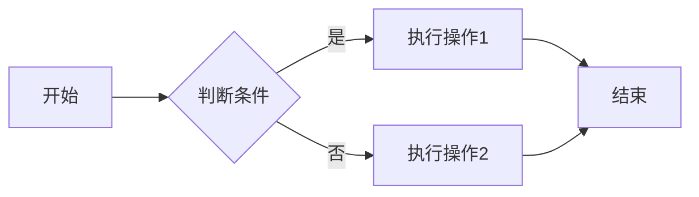
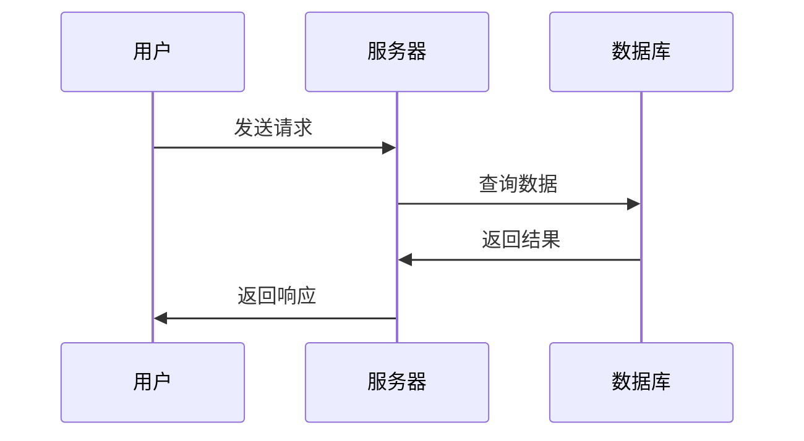
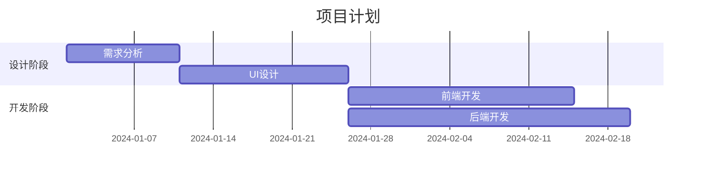

# Typora 与 Markdown 文档编写教程

本教程将教你如何使用 Typora 编辑器编写漂亮的 Markdown 文档。

## 📋 目录

- [什么是 Markdown](#什么是-markdown)
- [什么是 Typora](#什么是-typora)
- [安装 Typora](#安装-typora)
- [Typora 基础设置](#typora-基础设置)
- [Markdown 基础语法](#markdown-基础语法)
- [插入元素](#插入元素)
- [高级功能](#高级功能)
- [实用技巧](#实用技巧)
- [常见问题](#常见问题)

## 什么是 Markdown

Markdown 是一种轻量级标记语言，具有以下特点：

- ✍️ **简单易学**：使用纯文本格式，语法简洁
- 📝 **专注内容**：无需关心排版细节
- 🔄 **可转换**：可导出为 HTML、PDF、Word 等格式
- 🌐 **广泛应用**：GitHub、博客、文档等都支持

Markdown 文件通常以 `.md` 或 `.markdown` 为扩展名。

## 什么是 Typora

Typora 是一款优秀的 Markdown 编辑器，特点包括：

- 👁️ **所见即所得**：实时预览，边写边看效果
- 🎨 **界面简洁**：专注写作，无干扰界面
- 📊 **支持图表**：内置数学公式、图表支持
- 🖼️ **图片管理**：方便的图片插入和管理
- 🎯 **多种主题**：可自定义编辑器外观

## 安装 Typora

### Windows 系统

1. **访问官网下载**
   - 官网：https://typora.io/
   - 点击 "Download" 按钮
   - 选择 Windows 版本下载
2. **安装步骤**
   - 双击下载的安装包
   - 选择安装路径
   - 点击"安装"完成
3. **激活（可选）**
   - Typora 需要购买许可证
   - 15 天免费试用期
   - 支持买断制（约 $14.99）

或也可向@Tiger要破解版压缩包Typora v1.9.5.rar，解压后点击Setup.exe，推荐安装至**非**系统盘。

安装完成后，打开安装路径，将解压后的另一个文件夹Crack中的winmm.dll在这里（图片所示的文件夹，路径不一定一样，但内容多半差不多！）


### macOS 系统

**方法一：官网下载**

- 访问 https://typora.io/ 下载 macOS 版本
- 将下载的 `.app` 拖入 Applications 文件夹

**方法二：使用 Homebrew**
```bash
brew install --cask typora
```

### Linux 系统

**Ubuntu/Debian：**
```bash
wget -qO - https://typora.io/linux/public-key.asc | sudo apt-key add -
sudo add-apt-repository 'deb https://typora.io/linux ./'
sudo apt-get update
sudo apt-get install typora
```

**其他发行版：**
访问官网查看对应安装方式：https://typora.io/#linux

### 免费替代品

如果不想购买 Typora，可以考虑以下免费替代：
- **Obsidian**（免费，功能强大）
- **Mark Text**（开源免费）
- **VS Code + Markdown Preview Enhanced 插件**
- **MarkdownPad**（Windows）

## Typora 基础设置

### 推荐设置

打开 Typora，进入 `文件` -> `偏好设置`：

**1. 通用设置**
- ✅ 启动时：创建新文件
- ✅ 自动保存
- ✅ 自动配对括号和引号

**2. 外观设置**
- 选择你喜欢的主题（推荐：GitHub 主题）
- 设置字体和字号

**3. 图像设置**（重要！）
- 插入图片时：选择 "复制到指定路径"
- 路径设置：`./assets/${filename}` 或 `./images`
- ✅ 优先使用相对路径
- ✅ 对本地位置的图片应用上述规则

**4. Markdown 设置**
- ✅ 智能标点
- ✅ 自动转义（如将 `--` 转为 `—`）
- 标题级别：1-6
- ✅ 显示行号（代码块）

**5. 编辑器设置**
- ✅ 默认缩进：2 个空格或 4 个空格
- ✅ 智能标点
- ✅ 拼写检查

## Markdown 基础语法

### 标题

使用 `#` 表示标题，`#` 的数量表示标题级别：

```markdown
# 一级标题
## 二级标题
### 三级标题
#### 四级标题
##### 五级标题
###### 六级标题
```

**效果：**

# 一级标题
## 二级标题
### 三级标题

**Typora 快捷键：**
- `Ctrl + 1` ~ `Ctrl + 6`：设置为 1-6 级标题
- `Ctrl + 0`：设置为普通段落

### 段落和换行

- **段落**：空一行即为新段落
- **换行**：行末添加两个空格 + 回车，或使用 `Shift + Enter`

```markdown
这是第一段。

这是第二段。

这是第三段的第一行。  
这是第三段的第二行。
```

### 文本样式

```markdown
**粗体文本** 或 __粗体文本__
*斜体文本* 或 _斜体文本_
***粗斜体*** 或 ___粗斜体___
~~删除线~~
<u>下划线</u>
==高亮文本==
H~2~O（下标）
X^2^（上标）
```

**效果：**
- **粗体文本**
- *斜体文本*
- ***粗斜体***
- ~~删除线~~
- <u>下划线</u>
- ==高亮文本==
- H~2~O
- X^2^

**Typora 快捷键：**
- `Ctrl + B`：粗体
- `Ctrl + I`：斜体
- `Ctrl + U`：下划线
- `Alt + Shift + 5`：删除线

### 列表

**无序列表：**
```markdown
- 项目一
- 项目二
  - 子项目 2.1
  - 子项目 2.2
- 项目三

或使用 * 或 + 符号：
* 项目一
+ 项目二
```

**有序列表：**
```markdown
1. 第一项
2. 第二项
3. 第三项
   1. 子项 3.1
   2. 子项 3.2
```

**任务列表：**
```markdown
- [ ] 未完成的任务
- [x] 已完成的任务
- [ ] 待办事项 1
- [ ] 待办事项 2
```

**效果：**
- [ ] 未完成的任务
- [x] 已完成的任务

**Typora 快捷键：**
- `Ctrl + Shift + ]`：有序列表
- `Ctrl + Shift + [`：无序列表
- `Tab`：增加缩进
- `Shift + Tab`：减少缩进

### 引用

```markdown
> 这是一级引用
> 
> > 这是二级引用
> > > 这是三级引用
```

**效果：**
> 这是一级引用
> 
> > 这是二级引用

**Typora 快捷键：**
- `Ctrl + Shift + Q`：引用

### 代码

**行内代码：**
```markdown
这是一段包含 `代码` 的文本。
使用 `git add .` 命令添加所有文件。
```

**代码块：**

````markdown
```python
def hello_world():
    print("Hello, World!")
```

```javascript
function helloWorld() {
    console.log("Hello, World!");
}
```

```bash
npm install
git clone https://github.com/user/repo.git
```
````

**效果：**
```python
def hello_world():
    print("Hello, World!")
```

**Typora 快捷键：**
- `Ctrl + Shift + K`：代码块
- `Ctrl + Shift + `` ` ``：行内代码

### 分割线

```markdown
---
或
***
或
___
```

**效果：**

---

### 表格

```markdown
| 姓名 | 年龄 | 职业 |
| ---- | ---- | ---- |
| 张三 | 25   | 工程师 |
| 李四 | 30   | 设计师 |
| 王五 | 28   | 产品经理 |
```

**对齐方式：**
```markdown
| 左对齐 | 居中对齐 | 右对齐 |
| :--- | :---: | ---: |
| 文本 | 文本 | 文本 |
```

**效果：**

| 姓名 | 年龄 | 职业 |
| ---- | ---- | ---- |
| 张三 | 25   | 工程师 |
| 李四 | 30   | 设计师 |

**Typora 快捷键：**
- `Ctrl + T`：插入表格
- 在表格中：
  - `Tab`：移到下一列
  - `Enter`：新建一行
  - `Ctrl + Enter`：退出表格

## 插入元素

### 插入链接

**基础链接：**
```markdown
[链接文本](https://www.example.com)
[百度](https://www.baidu.com)
[GitHub](https://github.com)
```

**效果：**
[百度](https://www.baidu.com)

**带标题的链接：**
```markdown
[链接文本](https://www.example.com "鼠标悬停时显示的标题")
```

**直接显示链接：**
```markdown
<https://www.example.com>
```

**引用式链接：**
```markdown
这是一个[参考链接][ref]

文档末尾定义：
[ref]: https://www.example.com "参考链接"
```

**内部跳转（锚点）：**
```markdown
[跳转到标题](#标题名称)

例如：
[跳转到安装章节](#安装-typora)
```

**Typora 快捷键：**
- `Ctrl + K`：插入链接

### 插入图片

**基础语法：**
```markdown


```

**带标题的图片：**
```markdown

```

**调整图片大小（HTML 方式）：**
```markdown


```

**在 Typora 中插入图片的方法：**

**方法一：拖拽**
- 直接将图片拖入编辑器

**方法二：复制粘贴**
- 复制图片，在编辑器中 `Ctrl + V` 粘贴

**方法三：快捷键**
- `Ctrl + Shift + I`：选择图片文件

**方法四：菜单**
- `格式` -> `图像` -> `插入本地图片`

**图片管理最佳实践：**

1. **创建图片文件夹**
   ```
   项目根目录/
   ├── README.md
   └── images/
       ├── screenshot1.png
       └── screenshot2.png
   ```

2. **Typora 图片设置**
   - 偏好设置 -> 图像
   - 插入图片时：复制到 `./images` 文件夹
   - 使用相对路径

3. **相对路径示例**
   ```markdown
   
   
   ```

**Typora 快捷键：**
- `Ctrl + Shift + I`：插入图片

### 插入数学公式

Typora 支持 LaTeX 数学公式。

**行内公式：**
```markdown
这是一个行内公式 $E=mc^2$
质能方程：$E=mc^2$
```

**块级公式：**
```markdown
$$
\frac{-b \pm \sqrt{b^2 - 4ac}}{2a}
$$

$$
\sum_{i=1}^{n} x_i = x_1 + x_2 + \cdots + x_n
$$
```

**常用数学符号：**
```markdown
分数：$\frac{a}{b}$
平方根：$\sqrt{x}$
求和：$\sum_{i=1}^{n}$
积分：$\int_{a}^{b}$
矩阵：
$$
\begin{bmatrix}
a & b \\
c & d
\end{bmatrix}
$$
```

**Typora 快捷键：**
- `Ctrl + Shift + M`：插入数学公式块

### 插入图表

Typora 支持多种图表绘制。

**流程图（Mermaid）：**
````markdown

````

**时序图：**
````markdown

````

**甘特图：**
````markdown

````

## 高级功能

### 目录（TOC）

自动生成文档目录：

```markdown
[TOC]

或在 Typora 中：
菜单 -> 段落 -> 内容目录
```

### 脚注

```markdown
这是一段包含脚注的文本[^1]。

这是另一个脚注[^note]。

[^1]: 这是脚注的内容。
[^note]: 这是命名脚注。
```

### 注释

```markdown
<!-- 这是注释，不会在渲染后显示 -->

<!--
多行注释
也可以这样写
-->
```

### 折叠内容

使用 HTML 的 details 标签：

```markdown
<details>
<summary>点击展开</summary>

这里是折叠的内容。

可以包含任何 Markdown 内容：
- 列表
- 代码块
- 图片等

</details>
```

### 嵌入 HTML

Markdown 支持嵌入 HTML 代码：

```html
<div style="background-color: #f0f0f0; padding: 10px;">
  这是一个灰色背景的区块
</div>

<font color="red">红色文字</font>

<center>居中文本</center>
```

### 表情符号（Emoji）

```markdown
:smile: :heart: :thumbsup: :rocket:
😀 ❤️ 👍 🚀
```

在 Typora 中输入 `:` 会自动提示 emoji。

## 实用技巧

### 快捷键汇总

**文件操作：**
- `Ctrl + N`：新建文件
- `Ctrl + O`：打开文件
- `Ctrl + S`：保存
- `Ctrl + Shift + S`：另存为

**编辑操作：**
- `Ctrl + Z`：撤销
- `Ctrl + Y`：重做
- `Ctrl + C/V/X`：复制/粘贴/剪切
- `Ctrl + F`：查找
- `Ctrl + H`：替换

**格式操作：**
- `Ctrl + 1~6`：1-6 级标题
- `Ctrl + 0`：段落
- `Ctrl + B`：粗体
- `Ctrl + I`：斜体
- `Ctrl + U`：下划线
- `Ctrl + K`：插入链接
- `Ctrl + Shift + I`：插入图片
- `Ctrl + T`：插入表格
- `Ctrl + Shift + K`：插入代码块
- `Ctrl + Shift + Q`：引用

**视图操作：**
- `Ctrl + Shift + L`：侧边栏
- `F8`：专注模式
- `F9`：打字机模式
- `F11`：全屏

### 主题自定义

Typora 支持自定义主题：

1. **下载主题**
   - 访问：https://theme.typora.io/
   - 选择喜欢的主题下载

2. **安装主题**
   - 解压下载的主题文件
   - `文件` -> `偏好设置` -> `外观` -> `打开主题文件夹`
   - 将主题文件复制到主题文件夹
   - 重启 Typora
   - 在 `主题` 菜单中选择新主题

**推荐主题：**
- **GitHub**（简洁、清晰）
- **Vue**（现代感）
- **Newsprint**（类似报纸）
- **Night**（暗色主题）
- **Pixyll**（优雅简约）

### 导出文档

Typora 支持导出多种格式：

**导出步骤：**
1. `文件` -> `导出`
2. 选择导出格式

**支持的格式：**
- **PDF**（需要安装 Pandoc）
- **HTML**
- **Word** (.docx)
- **OpenOffice** (.odt)
- **RTF**
- **LaTeX**
- **MediaWiki**
- **图片** (PNG/JPEG)

**导出 PDF 配置：**
1. 安装 Pandoc：https://pandoc.org/installing.html
2. Typora -> 偏好设置 -> 导出 -> PDF
3. 选择页边距、字体等设置

### 文档模板

创建常用文档模板，提高效率：

**会议记录模板：**
```markdown
# 会议记录

**会议主题**：[主题]
**时间**：2024-01-01 14:00-15:00
**地点**：[地点]
**参会人员**：张三、李四、王五

## 会议议程

1. 议题一
2. 议题二
3. 议题三

## 讨论内容

### 议题一
- 讨论要点
- 决议事项

### 议题二
- 讨论要点
- 决议事项

## 行动项

- [ ] 任务1 - 责任人：张三 - 截止日期：2024-01-10
- [ ] 任务2 - 责任人：李四 - 截止日期：2024-01-15

## 下次会议

**时间**：2024-01-15 14:00
**议题**：[待定]
```

**项目文档模板：**
```markdown
# 项目名称

## 项目概述

简要描述项目的目标和功能。

## 技术栈

- 前端：React, TypeScript, Tailwind CSS
- 后端：Node.js, Express, MongoDB
- 部署：Docker, AWS

## 功能列表

- [x] 用户注册登录
- [x] 数据展示
- [ ] 数据导出
- [ ] 权限管理

## 安装说明

\`\`\`bash
git clone https://github.com/user/project.git
cd project
npm install
npm start
\`\`\`

## 项目结构

\`\`\`
project/
├── src/
│   ├── components/
│   ├── pages/
│   └── utils/
├── public/
└── README.md
\`\`\`

## 贡献指南

欢迎提交 Pull Request！

## 许可证

MIT License
```

### 协作技巧

**版本控制集成：**
- 将 Markdown 文件纳入 Git 管理
- 使用 Git 跟踪文档变更
- 通过 Pull Request 进行文档审查

**命名规范：**
```
良好的命名：
- README.md
- 安装指南.md
- API-文档.md
- 2024-01-01-会议记录.md

避免：
- 文档1.md
- 新建文档.md
- doc.md
```

## 常见问题

### 1. 图片无法显示

**原因：**
- 图片路径错误
- 图片已被移动或删除
- 使用了绝对路径

**解决方法：**
- 使用相对路径
- 确保图片文件存在
- 在 Typora 设置中配置图片自动复制

### 2. 导出 PDF 失败

**原因：**
- 未安装 Pandoc
- 文档包含不支持的元素

**解决方法：**
1. 安装 Pandoc：
   ```bash
   # Windows（使用 Chocolatey）
   choco install pandoc
   
   # macOS
   brew install pandoc
   
   # Ubuntu
   sudo apt install pandoc
   ```
2. 重启 Typora
3. 尝试重新导出

### 3. 代码块不高亮

**解决方法：**
- 指定代码语言：```python
- 检查主题是否支持代码高亮
- 更换主题尝试

### 4. 数学公式不显示

**解决方法：**
- 偏好设置 -> Markdown -> 启用数学公式
- 使用正确的 LaTeX 语法
- 检查公式是否有语法错误

### 5. 表格无法编辑

**解决方法：**
- 点击表格进入编辑模式
- 使用 `Ctrl + T` 重新插入表格
- 在源代码模式下编辑（`Ctrl + /`）

### 6. 无法打开 .md 文件

**解决方法：**
- 检查文件编码（应为 UTF-8）
- 尝试用记事本打开后另存为 UTF-8
- 重新创建文件

### 7. 如何查看源代码

**方法一：**
- `Ctrl + /`：切换源代码模式

**方法二：**
- `视图` -> `源代码模式`

### 8. 如何备份设置和主题

**备份位置：**
- Windows：`%APPDATA%\Typora`
- macOS：`~/Library/Application Support/abnerworks.Typora/`
- Linux：`~/.config/Typora/`

复制这些文件夹即可备份。

## Markdown 最佳实践

### 1. 保持简洁

```markdown
❌ 不好的做法：
# 欢迎！！！
**这是一个非常重要的标题！！！**

✅ 好的做法：
# 欢迎
这是一个重要的标题
```

### 2. 合理使用标题层级

```markdown
✅ 正确的层级：
# 主标题
## 二级标题
### 三级标题
#### 四级标题

❌ 避免跳级：
# 主标题
### 三级标题（跳过了二级）
```

### 3. 列表格式统一

```markdown
✅ 统一使用 - 或 * 或 +
- 项目 1
- 项目 2
- 项目 3

❌ 不要混用：
- 项目 1
* 项目 2
+ 项目 3
```

### 4. 代码块指定语言

```markdown
✅ 指定语言以获得语法高亮：
```python
def hello():
    print("Hello")
```

❌ 不指定语言：
```
def hello():
    print("Hello")
```
```

### 5. 链接和图片使用描述性文本

```markdown
✅ 好的做法：
[Git 官方文档](https://git-scm.com/doc)


❌ 不好的做法：
[点击这里](https://git-scm.com/doc)

```

### 6. 合理使用空行

```markdown
✅ 可读性好：
## 标题

这是段落内容。

这是另一个段落。

- 列表项 1
- 列表项 2

❌ 可读性差：
## 标题
这是段落内容。
这是另一个段落。
- 列表项 1
- 列表项 2
```

## 学习资源

### 在线工具

- 📝 [Markdown 在线编辑器](https://dillinger.io/)
- 🎨 [Markdown Tables Generator](https://www.tablesgenerator.com/markdown_tables)
- 📊 [Mermaid Live Editor](https://mermaid.live/)
- 🔢 [LaTeX 公式编辑器](https://www.latexlive.com/)

### 参考文档

- 📖 [Markdown 官方教程](https://www.markdownguide.org/)
- 📚 [GitHub Markdown 指南](https://guides.github.com/features/mastering-markdown/)
- 🎓 [Typora 官方文档](https://support.typora.io/)

### 速查表

- [Markdown Cheat Sheet](https://www.markdownguide.org/cheat-sheet/)
- [Typora 快捷键速查](https://support.typora.io/Shortcut-Keys/)

## 总结

Markdown 是一种简单而强大的文档编写工具，结合 Typora 可以获得极佳的写作体验。

**核心要点回顾：**

1. **基础语法**
   - 标题：`#` ~ `######`
   - 粗体：`**文本**`
   - 斜体：`*文本*`
   - 列表：`-` 或 `1.`
   - 链接：`[文本](URL)`
   - 图片：``

2. **Typora 优势**
   - 所见即所得编辑
   - 丰富的快捷键
   - 图片管理便捷
   - 支持多种导出格式

3. **最佳实践**
   - 使用相对路径存储图片
   - 保持文档结构清晰
   - 合理使用标题层级
   - 定期备份重要文档

**建议的学习路径：**
1. 掌握基础语法（标题、列表、链接、图片）
2. 熟悉 Typora 常用快捷键
3. 学习表格和代码块使用
4. 探索高级功能（数学公式、图表）
5. 建立自己的文档模板库

---

开始你的 Markdown 写作之旅吧！📝

有问题欢迎提 Issue 讨论！

